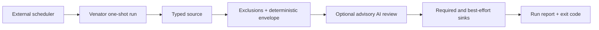

<p align="center">
  
</p>

# Venator

Venator is a scheduler-neutral batch detection engine. One invocation runs one
versioned rule, turns typed query results into one canonical finding model,
hands those findings to the configured sinks, and exits with an honest status
code. Archival sinks retain the envelope; human-notification sinks may render a
bounded projection.

It is intentionally not a SIEM, log shipper, or required Kubernetes service.
Run it from a laptop, an AI-agent tool, launchd, systemd, Nomad, Docker, or a
Kubernetes CronJob. The original design motivation is described in
[Open-sourcing Venator](https://detect.fyi/open-sourcing-venator-b94374e30a55).

## Why Venator

Venator gives each detection a strict, versioned, one-shot execution contract:
typed input, exclusions, stable finding identity, explicit delivery semantics,
and a truthful exit status. When each rule is scheduled as its own job, the
scheduler also gives it independent logs, history, retries, and manual reruns.
The first-class Helm workflow preserves that rule-per-CronJob model for direct
operation and debugging in GKE and other Kubernetes control planes.

v0.2.0 keeps that operational model and makes the same runner useful outside
Kubernetes. A local agent, laptop scheduler, systemd timer, Nomad job, or other
automation can invoke one rule and act on the same output and exit status.

## v0.2.0 architecture



The important boundary is deterministic: source records are never replaced by
model-generated records. AI review can add a structured verdict and reason to
a stable finding ID, but a prompt injection, malformed model response, or API
failure cannot silently erase a detection.

Every finding includes:

- a stable SHA-256 ID derived from the rule UID and source evidence;
- a per-execution run ID and timestamps;
- rule, source, confidence, tag, and ATT&CK metadata;
- commonly queried signal attributes when mapped; and
- a payload containing the complete typed source record in raw mode, or only
  the selected normalized fields in signal mode.

## Quick start without a SIEM

Venator v0.2.0 requires Go 1.25.12 or newer. Earlier Go 1.25 patch releases
contain standard-library vulnerabilities in network paths Venator uses.

```sh
go build -trimpath -o venator .

./venator validate \
  --global-config deploy/examples/global.yaml \
  --rule-config deploy/examples/rule.yaml

./venator run \
  --global-config deploy/examples/global.yaml \
  --rule-config deploy/examples/rule.yaml
```

The example needs no credentials or external service. It reads a finite NDJSON
snapshot through `file.ndjson` and emits canonical finding NDJSON through
`stdout.default`. A separate `stdin.default` source remains ideal for Tenzir or
agent pipelines. Logs go to stderr, so stdout stays machine-readable. Legacy
v0.1 flags without the `run` subcommand remain an alias during migration.

Use `--report-file run.json` for an atomic JSON run report. Exit status is zero
for a completed run (including no findings or a disabled rule) and non-zero for
configuration, source, required-sink, timeout, or cancellation failures.
`runtime.maxRecords` and `runtime.maxBytes` bound materialized results and
canonical output before sink fan-out.

## Sources and sinks

| Connector | Source | Sink | Notes |
| --- | ---: | ---: | --- |
| [stdin/stdout NDJSON](connector/stdio/) | yes | yes | Built in; ideal for Tenzir, agents, and pipelines |
| [finite NDJSON file](connector/stdio/) | yes | no | `file.ndjson`; rule-relative path, no hidden checkpoint state |
| [ClickHouse](connector/clickhouse/) | yes | yes | Official Go driver, native/HTTP, typed rows, bounded queries, batch writes |
| [OpenSearch](connector/opensearch/) | yes | yes | Bounded SQL/PPL queries and idempotent bulk finding writes |
| [BigQuery](connector/bigquery/) | yes | yes | Typed query values; sink role requires dataset and table |
| [Pub/Sub](connector/pubsub/) | no | yes | Canonical finding messages with serialization and publish failures surfaced |
| [Slack](connector/slack/) | no | yes | Bounded human-readable notifications; intentionally lossy |

ClickHouse configuration and a home-lab Compose stack are in
[`connector/clickhouse/`](connector/clickhouse/) and
[`deploy/clickhouse/`](deploy/clickhouse/). Tenzir can either stream filtered
NDJSON directly into Venator or collect into ClickHouse; see
[`deploy/tenzir-clickhouse/`](deploy/tenzir-clickhouse/).

## Rules

A rule owns detection semantics and output mapping, not process scheduling:

```yaml
name: local-ndjson-alert
uid: 6722b4ed-f891-4906-a4b2-f57762dfc72b
status: stable
confidence: high
enabled: true
schedule: "5 * * * *" # deployment metadata
queryEngine: file.ndjson
publishers: [stdout.default]
language: NDJSON
query: events.ndjson
output:
  format: raw
  fields: []
```

Entries in `publishers` are required-delivery sinks: any failure makes the run
fail after all required sinks have been attempted. `bestEffortPublishers` are
attempted and recorded but do not fail an otherwise completed run. At least one
sink across the two lists is required. Exclusion paths can be relative to the
rule file outside Helm; chart-managed rules use packaged exclusion paths.

Configuration parsing is strict. Unknown keys, invalid enums, duplicate sinks,
unsafe ClickHouse identifiers, and incomplete connector configurations are
rejected. An active run preflights its source and required sinks before issuing
the query; `venator validate` also checks best-effort sinks. Expansion happens
after YAML decoding, so secret characters cannot alter the configuration
structure. String values in connector instances and the global `llm` block
expand braced `${NAME}` references; instance keys, typed non-string fields, and
rule files are not interpolated. See the authoritative
[rule and exclusion reference](docs/rule-reference.md).

## AI review

The legacy `llm` rule block now enables advisory review rather than replacing
query results. Venator uses the official OpenAI Go SDK, the Responses API, and a
strict structured-output schema. Evidence is JSON-encoded, capped, labeled as
untrusted, and referenced only by stable finding ID. No tools are exposed to
the reviewer.

LLM evidence is an explicit egress boundary. Use `llm.evidenceFields` as a
top-level allowlist and `llm.redactFields` for sensitive values. Review has its
own timeout and reserves time for deterministic publishers.

AI review is best effort by default. Set `llm.required: true` only when a
missing annotation should make the process return non-zero after deterministic
findings have still been delivered. A concise local rule is available in
[`config/examples/llm-review-rule.yaml`](config/examples/llm-review-rule.yaml).

## Deployment

[`deploy/`](deploy/) contains runnable guidance and templates for:

- local binaries and local AI-agent tools;
- macOS launchd and Linux systemd timers;
- Docker Compose and a ClickHouse home lab;
- Nomad periodic batch jobs; and
- Kubernetes CronJobs through the first-class Helm chart or plain Kustomize.

The binary remains a one-shot process in every model. Schedulers own calendars,
overlap control, deadlines, and retries; Venator owns detection, stable identity,
delivery receipts, and truthful exit status. See the full
[deployment guide](docs/deployment.md).

## Development

```sh
go test ./...
go test -race ./...
go vet ./...
```

Normal tests are hermetic. Live connector tests are opt-in and never terminate
the test process when a local service is absent.

Venator is licensed under MIT. The v0.2.0 fork keeps the original
copyright and attribution in [`LICENSE`](LICENSE).
