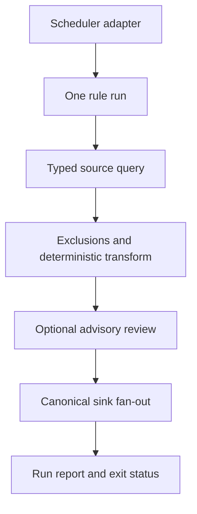

# Architecture

Venator is a deterministic one-shot rule runner with scheduler adapters around
it. The design follows five boundaries.

## 1. Scheduling is an adapter

The binary does not keep a clock or run a daemon. Helm maps enabled rules and
their schedule metadata to Kubernetes CronJobs; launchd, systemd, Nomad, an AI
agent, or a human can invoke the same command. This retains GKE's useful job
history and debugging UI without making the engine depend on Kubernetes APIs.

## 2. Sources preserve types

`model.Record` is `map[string]any`. Sources retain nulls, booleans, numbers,
timestamps, lists, and nested values. Text conversion occurs only for textual
signal mappings and textual exclusion comparisons. Queries are bounded by
context deadlines and connector row/byte/response limits. `stdin.default` is a
pipeline boundary; `file.ndjson` reads one finite rule-relative snapshot. It is
not a tailer and owns no hidden offset.

Rule queries are trusted operator code, not a sandbox. Server-side
least-privilege credentials remain the authoritative control for SQL and PPL
sources; client limits bound cost and results but do not replace authorization.

## 3. The engine builds each finding once

The engine applies exclusions, builds raw or signal output once, and wraps it
in `venator.finding/v1`. Raw output retains the complete typed source record;
signal output deliberately retains only mapped normalized fields. Every sink
gets that same object. A finding ID is the SHA-256 of the rule UID plus the
complete source evidence by default. A rule may instead select exact top-level
`identity.fields`, which keeps the ID stable when unrelated run timestamps or
metadata change. Every selected field must exist on each retained record. If
two different records in one result share a projection, the run fails instead
of assigning an order-dependent identity; byte-identical rows retain stable
occurrence IDs. Cross-run and cross-population uniqueness remains the
operator's responsibility. Include a host or tenant field when an event key is
only locally unique. The rule UID remains the identity namespace: reuse it
across edits to preserve a lineage, or change it when an edit should create a
new one. Never share a UID between unrelated concurrently deployed rules.

## 4. AI is untrusted advisory enrichment

Log evidence is untrusted model input. The reviewer receives capped JSON with
stable IDs, no tools, and a strict response schema. It can attach suspicious,
benign, or uncertain advice to known IDs. It cannot return replacement records
or remove deterministic findings. Failure is best effort unless a rule marks
review as required; even then findings are delivered before the run reports a
review failure.

## 5. Delivery is explicit

Entries in `publishers` use required-delivery semantics;
`bestEffortPublishers` entries do not fail an otherwise successful run. At least
one sink across the two lists is required. Sinks fan out concurrently, retain
configured receipt ordering, and are all attempted. Any required failure makes
the process exit non-zero. A scheduler retry can repeat a successful Slack or
Pub/Sub delivery after another sink failed. Stable IDs let idempotent sinks use
upserts or deduplication; the ClickHouse schema uses that ID as its replacement
key.

## State boundary

v0.2.0 deliberately does not keep log data or a hidden scheduler database.
ClickHouse/OpenSearch/BigQuery can own queryable history, while an external
collector owns file watching and parsing. Direct NDJSON allows any local tool
to provide already filtered candidates. v0.2.0 has no checkpoint state. Any
future incremental source requires an explicit durable acknowledgement and
replay contract before it can advance a cursor.
