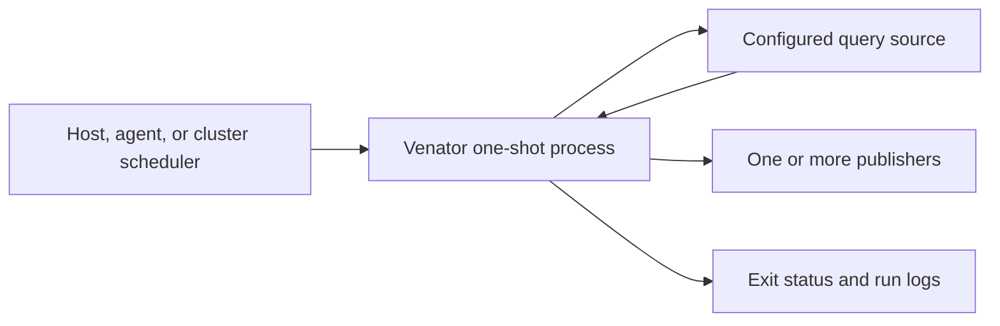

# Deploying Venator v0.2.0

Venator does not require Kubernetes. It is a one-shot detection process with a
small contract: provide one global connector file and one rule file, observe
the process exit status, and let any scheduler decide when to invoke it.



Deployment templates live in [`deploy/`](../deploy/):

| Model | Best for | Scheduling owner |
| --- | --- | --- |
| [Local binary](../deploy/local/) | Ad-hoc runs and home labs | User or calling tool |
| [AI agent](../deploy/agent/) | Codex, Hermes, and other local agent tools | Agent platform |
| [macOS launchd](../deploy/launchd/) | Always-on or frequently sleeping Macs | launchd |
| [Linux systemd](../deploy/systemd/) | Servers and Linux workstations | systemd timer |
| [Docker Compose](../deploy/docker-compose/) | Containerized one-shot runs | Host scheduler |
| [Nomad](../deploy/nomad/) | Periodic cluster batch workloads | Nomad |
| [Kubernetes](../deploy/kubernetes/) | Detection fleets and GKE operations | Helm or CronJob/Kustomize |
| [ClickHouse](../deploy/clickhouse/) | Retained home-lab telemetry and findings | Any host scheduler |
| [Tenzir](../deploy/tenzir-clickhouse/) | Local collection and shaping | Tenzir plus any scheduler |

## 1. Prepare configuration

The binary accepts the same scheduler-neutral arguments everywhere:

```sh
venator \
  run \
  --global-config /path/to/global.yaml \
  --rule-config /path/to/rule.yaml
```

The rule's `schedule` field does not delay a direct invocation. It serves as
portable metadata for deployment tooling. Configure an
independent job per rule so failures, deadlines, and retries are observable.

Before deployment, verify that:

- the rule is enabled and its `queryEngine` exactly matches a configured source;
- every publisher name exactly matches a configured sink;
- example placeholders have been replaced with valid queries and endpoints;
- `exclusionsPath`, when present, points to a file mounted at that exact path;
- the scheduler's interval and the query's time window do not create gaps; and
- publisher retries cannot create unacceptable duplicate alerts.

Configuration supports lazy environment expansion after YAML decoding. Only
connectors selected by the rule require their variables. Prefer references such
as:

```yaml
opensearch:
  instances:
    production:
      url: https://opensearch.example:9200
      username: venator
      password: ${OPENSEARCH_PASSWORD}
      insecureSkipVerify: false
```

Do not put real webhook URLs, API keys, or passwords in Git. `.env`, `*.env`, and
`.vcfg.env` are ignored, but a platform secret store is safer than a local file.

## 2. Build a binary or image

Build a local binary with Go 1.25.12 or newer:

```sh
mkdir -p bin
go build -trimpath -o bin/venator .
./bin/venator \
  run \
  --global-config deploy/examples/global.yaml \
  --rule-config deploy/examples/rule.yaml
```

Build the v0.2.0 container image:

```sh
VERSION=0.2.0 VENATOR_IMAGE=ghcr.io/0x4d31/venator:v0.2.0 \
  sh scripts/build_image.sh
```

Set `PUSH=true` only after authenticating to the selected registry. The image
runs as UID/GID `65532`, has a read-only-compatible root filesystem, and includes
CA roots and timezone data. Bind-mounted configuration must be readable by that
user.

## 3. Pick a scheduler

### Local or agent driven

For a manual run, invoke the binary directly and preserve its numeric exit
status. For local agent tools, configure an executable plus an argument array,
not a free-form shell string. Keep rule YAML read-only to the agent and put
credentials in its secret store or inherited environment. The agent may report
on a run, but it should not infer success from log wording or silently alter a
time window. See the [agent contract](../deploy/agent/).

### macOS

Install the user LaunchAgent from [`deploy/launchd/`](../deploy/launchd/). It
runs after login, needs no root daemon, and executes delayed calendar work once
after a sleeping Mac wakes. Use one plist per rule and inspect the recorded
launchd exit status and separate stdout/stderr logs.

### Linux

Install the templated service and timer from
[`deploy/systemd/`](../deploy/systemd/). The service uses a dynamic unprivileged
user and a hardened filesystem/process sandbox while retaining outbound network
access. Use timer drop-ins for rule-specific schedules rather than editing the
shipped unit.

### Docker Compose

The Compose file is an ephemeral job, not a long-running service:

```sh
cd deploy/docker-compose
docker compose config
docker compose --profile run run --rm -T venator \
  < ../../config/examples/events.ndjson
```

Use systemd, cron, a home-automation service, or an agent to invoke that command
recurringly. Do not use an unconditional container restart policy as a
scheduler; it obscures completed runs and can create a tight failure loop.

### Nomad

The sample periodic batch job runs hourly, prohibits overlap, and has bounded
retries:

```sh
nomad job validate deploy/nomad/venator.nomad.hcl
nomad job plan deploy/nomad/venator.nomad.hcl
nomad job run deploy/nomad/venator.nomad.hcl
```

The sample targets Nomad 1.8+ and requests a read-only `venator-config` host
volume. Register that volume on eligible clients or replace it with your
cluster's dynamic-volume or artifact/template pattern. Render secrets from
Nomad Variables or Vault into environment variables instead of committing them
to HCL. Venator's runtime timeout bounds the task on Nomad versions that do not
support a group-level maximum run duration.

### Plain Kubernetes

The checked-in Kustomization is a runnable finite-file smoke deployment for
Kubernetes 1.27+ (`spec.timeZone` requires 1.27):

```sh
kubectl kustomize deploy/kubernetes
kubectl apply -k deploy/kubernetes
kubectl create job --from=cronjob/venator-example \
  "venator-manual-$(date +%s)" -n venator
```

The CronJob forbids overlap, limits late starts and execution time, uses no
service-account token, and runs the image as non-root on a read-only root
filesystem. Create a separate ConfigMap and CronJob for every rule. Mount an
exclusion ConfigMap only for rules that actually reference it. For production,
replace the generated sample files in an overlay or use
`scripts/create_configmap.sh`; annotate the dedicated ServiceAccount for GKE
Workload Identity when Google connectors use ADC.

### Helm detection fleet

The chart in [`config/`](../config/) remains the primary automated Kubernetes
deployment: every enabled rule YAML becomes its own CronJob and ConfigMap, so
run history, failures, logs, retries, and ad-hoc Jobs remain visible in GKE or
any Kubernetes control plane.

```sh
helm lint config
helm template venator config --namespace venator
helm upgrade --install venator config \
  --namespace venator --create-namespace \
  --set container.image=ghcr.io/0x4d31/venator:v0.2.0
```

For GKE Workload Identity, either create the chart ServiceAccount with the GSA
annotation or point rules at existing KSAs:

```yaml
serviceAccount:
  create: true
  name: venator
  annotations:
    iam.gke.io/gcp-service-account: venator@PROJECT_ID.iam.gserviceaccount.com
ruleServiceAccounts:
  high-privilege-rule: venator-restricted
```

Set `secretEnv: []` and use `ruleSecretEnv.<rule-name>` when credentials should
not be exposed to every rule pod.

ClickHouse TLS and mTLS files can come from Kubernetes Secrets through the
chart's `extraVolumes`/`extraVolumeMounts` values. Prefer the keyed
`ruleExtraVolumes`/`ruleExtraVolumeMounts` variants so only the relevant
CronJob receives a client key. A plain Kustomize deployment can add the same
mount through an overlay.

The v0.2.0 chart keeps the repository-backed rule workflow while adding
overlap control, deadlines, bounded history/retries, optional exclusion mounts,
global or per-rule existing-Secret injection, TLS file mounts, optional per-rule ServiceAccounts,
non-root defaults, and a versioned release image. Completed Jobs are not
TTL-deleted by default, preserving the GKE debugging workflow; history limits
remain configurable. Pin the image by digest where immutability is required.
Render the chart in CI before upgrading a fleet.

## Operations checklist

- Use UTC for rule windows and scheduler calendars unless a rule explicitly
  requires another zone.
- Set a deadline shorter than the next interval and prevent concurrent runs.
- Alert on non-zero exits and on runs that never start.
- Keep source and publisher credentials least-privileged and rotate them
  independently.
- Set `runtime.maxRecords` and `runtime.maxBytes`, then add a scheduler memory
  limit as a second boundary.
- Retain stderr and scheduler metadata without placing finding payloads or
  credentials into broadly readable logs.
- Treat at-least-once schedulers as capable of duplicate execution; use stable
  finding identities or idempotent sinks where duplicate alerts matter.
- Test a manual run with a non-production sink before enabling recurrence.
